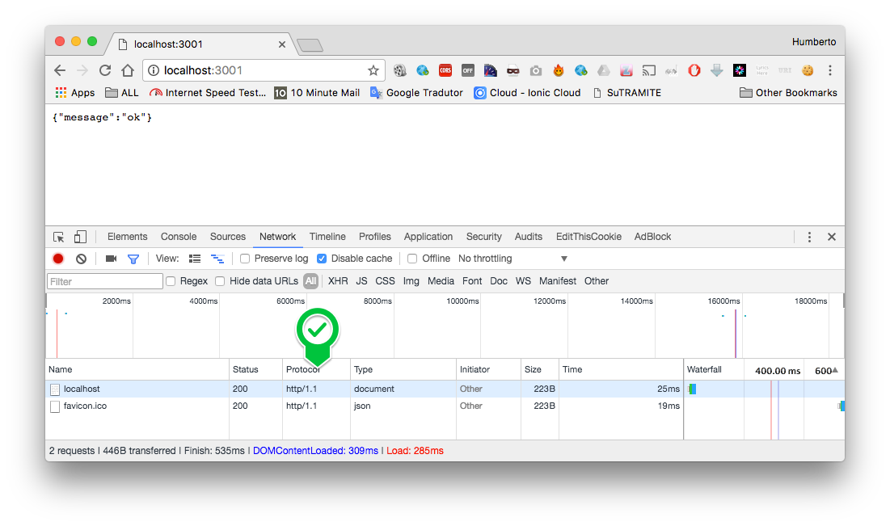
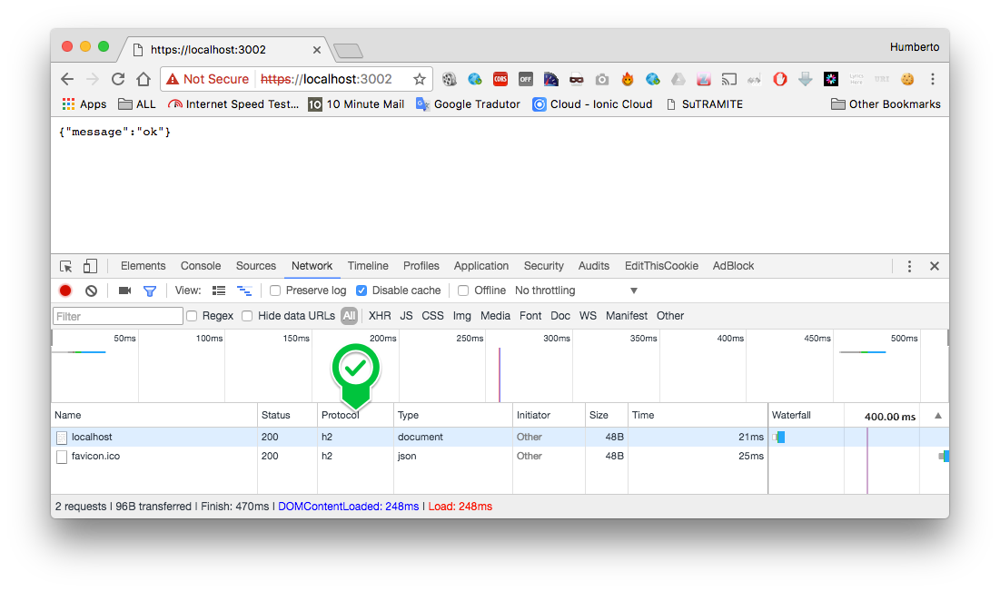

# HTTP 1 vs 2

Node app to compare http 1 vs 2 protocol.

# Running

```
node http-1.js
```

Console

```
Listening on port: 3001.
```



```
node http-2.js
```

Console

```
Listening on port: 3002.
```




# Result

| Protovcol        | Size           | Time  |
| ------------- |:-------------:| -----:|
| http/1    | 223B| 25ms |
| http/2      | 48B      |   21ms|

http/2 spent 223/48 = **4.66x** less bytes than http/1 response.


# References

1. [Easy HTTP/2 Server with Node.js and Express.js](https://webapplog.com/http2-node/)
2. [As-fantasticas-novidades-do-http-2-0-e-do-spdy](http://blog.caelum.com.br/as-fantasticas-novidades-do-http-2-0-e-do-spdy/)
3. [http-2-with-node-js](https://medium.com/@imjacobclark/http-2-with-node-js-85da17322812#.uhmkvr54u)
4. [http2-curl-macosx](https://simonecarletti.com/blog/2016/01/http2-curl-macosx/)
