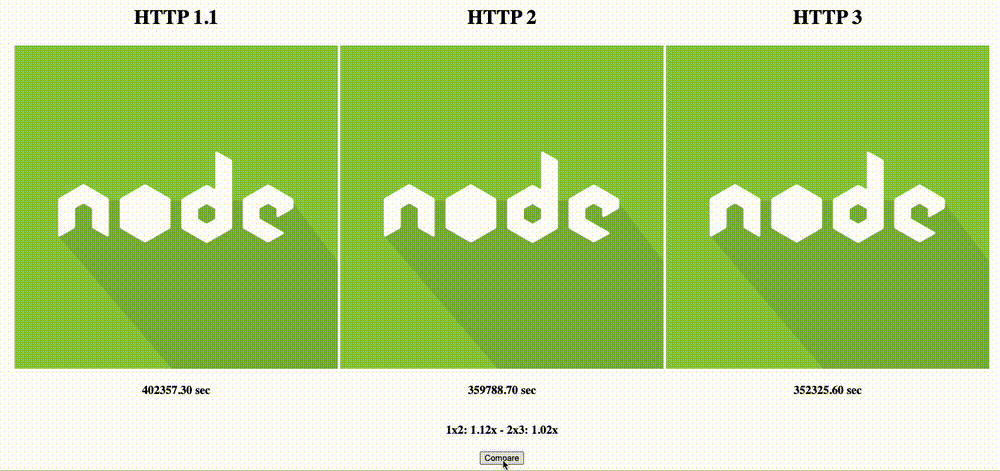

# HTTP 1 vs 2 vs 3

Node app to compare http 1 vs 2 vs 3 protocol.

## Prerequires

1. [Git](https://git-scm.com/downloads) 2.9+
2. [Node](https://nodejs.org/en/download) v10.16.0
3. [Docker](https://www.docker.com) 25+

## Running

Clone

```shell
git clone https://github.com/humbertodias/node-http-1-vs-2.git 
cd node-http-1-vs-2
```

Run

```shell
docker compose up -d
```


Access the gateway

http://localhost:3000

## Result



http/2 spent 223/48 = **4.66x** less bytes than http/1 response.


| Protocol      | Size          | Time  |
| ------------- |:-------------:| -----:|
| http/1        | 223B          | 25ms  |
| http/2        | 48B           | 21ms  |
| http/3        | 44B           | 20ms  |


> [!NOTE]  
> The original image [nodejs.png](img/nodejs.png) has 512x512 and each tile was cropped as 16x16


## References

1. [Easy HTTP/2 Server with Node.js and Express.js](https://webapplog.com/http2-node/)
2. [As-fantasticas-novidades-do-http-2-0-e-do-spdy](http://blog.caelum.com.br/as-fantasticas-novidades-do-http-2-0-e-do-spdy/)
3. [http-2-with-node-js](https://medium.com/@imjacobclark/http-2-with-node-js-85da17322812#.uhmkvr54u)
4. [http2-curl-macosx](https://simonecarletti.com/blog/2016/01/http2-curl-macosx/)
5. [h3](https://github.com/unjs/h3)
